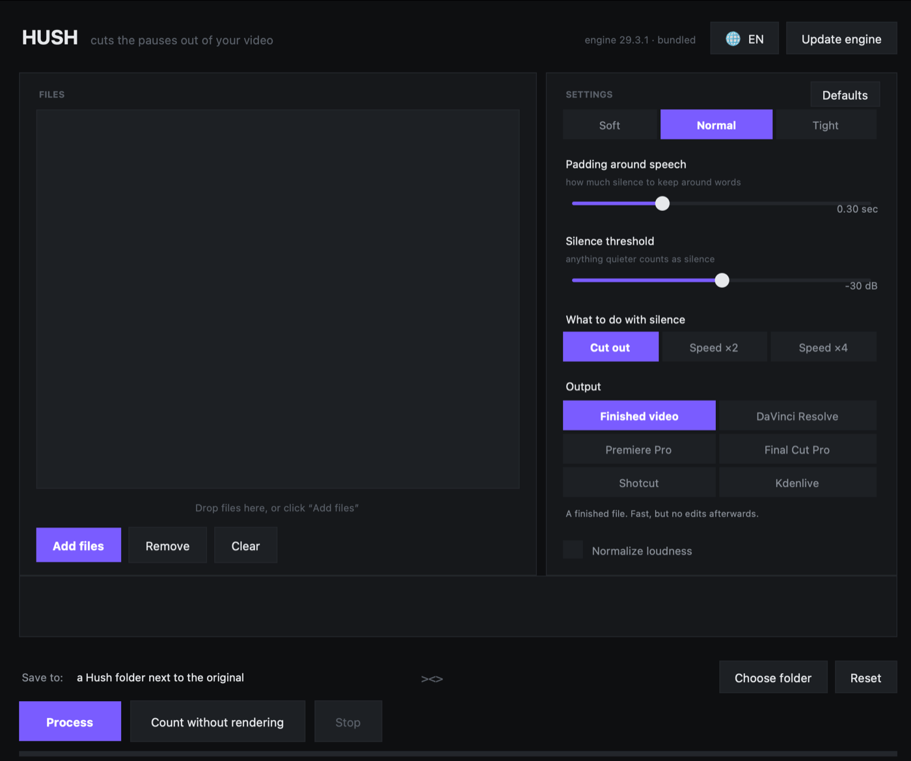

<div align="center">


# Hush

**Cuts the pauses out of your video.**
A desktop window for [auto-editor](https://github.com/WyattBlue/auto-editor) — no terminal, no Python, no internet.

[](../../releases/latest)
[](../../releases/latest)
[](LICENSE)

[Download](../../releases/latest) · [Русская версия](README.ru.md)

</div>



---

## What it is

You record yourself talking. Half the footage is you breathing, thinking, and
reaching for the mouse. Cutting that by hand takes hours.

`auto-editor` does it in seconds, but it lives in the terminal and has forty
flags. **Hush is a window around it.** Drop your files in, pick how aggressive
you want it, press one button.

The engine ships inside the app. Nothing is downloaded at runtime, nothing is
installed, and it works with the network off.

## Download

Grab the build for your machine from **[Releases](../../releases/latest)**:

| File | For |
|---|---|
| `Hush-macOS-arm64.zip` | Mac with Apple Silicon (M1–M4) |
| `Hush-macOS-x86_64.zip` | Intel Mac |
| `Hush-Windows-x64.zip` | Windows 10/11, 64-bit |
| `Hush-Linux-x86_64.zip` | Linux, 64-bit |

**macOS** will say the app is from an unidentified developer, because it is not
notarised. Right-click `Hush.app` → **Open** → **Open**. Once.

## What it does

- **Drag and drop** a queue of files, or add them with a button
- **Three presets** — Soft, Normal, Tight — for how hard to cut
- **Padding around speech** so words don't get clipped mid-consonant
- **Silence threshold** in dB, for noisy rooms
- **Cut the silence, or speed it up** ×2 / ×4 instead of removing it
- **Count without rendering** — tells you exactly how much will go, in a second, before committing
- **Normalize loudness** on the way out
- **Export to an editor instead of a file** — DaVinci Resolve, Premiere Pro, Final Cut Pro, Shotcut, Kdenlive
- **Russian and English**, switched with one button, remembered between runs
- **Update the engine** from inside the app when you're online

## Finished video, or a timeline?

This is the choice that matters.

**Finished video** gives you an `.mp4`. Fast, done, no edits afterwards.

**An editor** gives you a project file — a timeline with the cuts already made.
Nothing is re-encoded, so it's instant and lossless. You open it and fix the
places the engine got wrong. For real work, take this one.

| Target | You get |
|---|---|
| DaVinci Resolve | `.fcpxml` |
| Premiere Pro | `.xml` |
| Final Cut Pro | `.fcpxml` |
| Shotcut | `.mlt` |
| Kdenlive | `.kdenlive` |

## Your original is never touched

Results go into a `Hush` folder next to the source:

```
My videos/
  talk.mp4              ← untouched
  Hush/
    talk_no_pauses.mp4  ← result
```

The app refuses to write to the input path, and adds a number if a name would
collide. You can point it somewhere else with **Choose folder**.

## Honest limitations

The engine reads **loudness**, not speech. It has no idea what you're saying.
That means:

- **Background music defeats it.** Music isn't silence, so nothing gets cut.
- **Two people talking** over each other comes out badly.
- **Quiet consonants** (s, f, sh) can get clipped — that's what the padding
  slider is for.

It shines on one person, one microphone, a quiet room. Talking-head videos,
tutorials, podcasts, screencasts. That's the job it does well, and it does save
hours there.

## Build from source

```bash
git clone https://github.com/EmptyOverlord/hush
cd hush
pip install -r requirements.txt
python3 fetch_engines.py        # downloads the auto-editor binary
python3 hush.py                 # run it
```

To produce a standalone app:

```bash
python3 -m PyInstaller --noconfirm --clean hush.spec
```

The result lands in `dist/`. Cross-compiling doesn't work — build Windows
binaries on Windows. CI does all four platforms on every tag; see
[`.github/workflows/release.yml`](.github/workflows/release.yml).

The icon is drawn by code, no image editor and no libraries — see
[`make_icon.py`](make_icon.py).

## Built with

- [auto-editor](https://github.com/WyattBlue/auto-editor) by WyattBlue — the engine that does the actual work. Public domain (Unlicense).
- [tkinterdnd2](https://github.com/Eliav2/tkinterdnd2) — drag and drop.
- Tkinter for the interface. No heavy UI framework, which is why the download is mostly just the engine.

## License

MIT. See [LICENSE](LICENSE).
