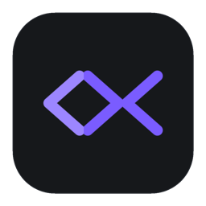
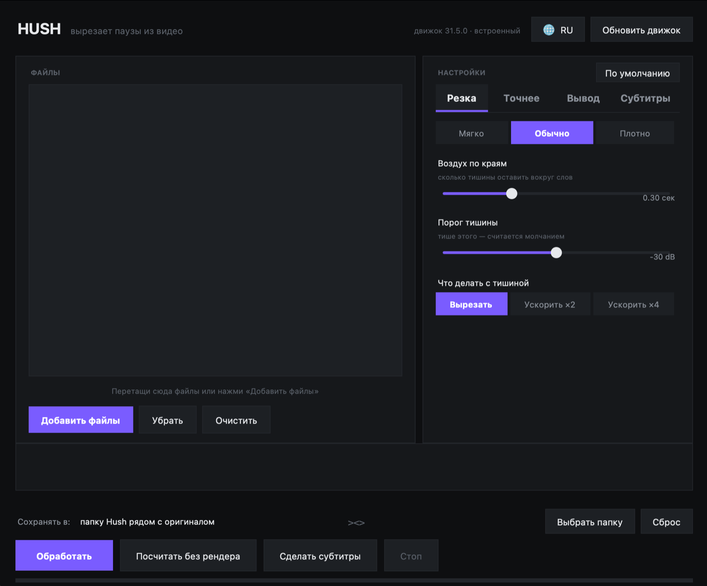

<div align="center">



# Hush

**Вырезает паузы из видео.**
Окно для [auto-editor](https://github.com/WyattBlue/auto-editor) — без терминала, без Python, без интернета.

[](../../releases/latest)
[](../../releases/latest)
[](LICENSE)

[Скачать](../../releases/latest) · [English](README.md)

</div>



---

## Что это

Ты записал себя говорящим. Половина материала — как ты дышишь, думаешь и
тянешься к мышке. Вырезать это руками — часы работы.

`auto-editor` делает то же самое за секунды, но живёт в терминале и имеет сорок
флагов. **Hush — окно вокруг него.** Кидаешь файлы, выбираешь насколько плотно
резать, жмёшь одну кнопку.

Движок лежит внутри приложения. Ничего не качается при запуске, ничего не
устанавливается, работает с выключенным интернетом.

## Скачать

Бери сборку под свою машину в **[Releases](../../releases/latest)**:

| Файл | Для чего |
|---|---|
| `Hush-macOS-arm64.zip` | Mac на Apple Silicon (M1–M4) |
| `Hush-macOS-x86_64.zip` | Mac на Intel |
| `Hush-Windows-x64.zip` | Windows 10/11, 64 бита |
| `Hush-Linux-x86_64.zip` | Linux, 64 бита |

**macOS** скажет, что приложение от неизвестного разработчика — оно не заверено
у Apple. Правый клик по `Hush.app` → **Открыть** → **Открыть**. Один раз.

## Что умеет

- **Перетаскивание файлов** в окно, очередь на несколько штук
- **Три пресета** — Мягко, Обычно, Плотно — насколько жёстко резать
- **Воздух по краям**, чтобы не отгрызало начала слов
- **Порог тишины** в децибелах, для шумной комнаты
- **Вырезать тишину или ускорить** её в 2 или 4 раза
- **Резать по звуку, по движению или по обоим** — для записей экрана, где картинка меняется, а человек молчит
- **Убирать чёрные кадры** — выкидывает затемнения и мёртвые куски
- **Плавные переходы** — растворение на месте каждого реза вместо жёсткой склейки
- **Посчитать без рендера** — за секунду скажет, сколько уйдёт, до обработки
- **Выровнять громкость** на выходе
- **Отдать в монтажку вместо файла** — DaVinci Resolve, Premiere Pro, Final Cut Pro, Shotcut, Kdenlive
- **Русский и английский**, переключается кнопкой, запоминается
- **Обновить движок** прямо из приложения, когда есть сеть

## Готовое видео или таймлайн?

Это главный выбор.

**Готовое видео** — это `.mp4`. Быстро, готово, правки уже не внести.

**Монтажка** — это файл проекта, таймлайн с уже сделанной нарезкой. Ничего не
перекодируется, поэтому мгновенно и без потери качества. Открываешь и правишь
там, где движок ошибся. Для настоящей работы бери этот вариант.

| Куда | Что получишь |
|---|---|
| DaVinci Resolve | `.fcpxml` |
| Premiere Pro | `.xml` |
| Final Cut Pro | `.fcpxml` |
| Shotcut | `.mlt` |
| Kdenlive | `.kdenlive` |

## Оригинал не трогается никогда

Результат кладётся в папку `Hush` рядом с исходником:

```
Мои видео/
  ролик.mp4              ← не тронут
  Hush/
    ролик_без_пауз.mp4   ← результат
```

Программа отдельно проверяет, что не пишет по пути входного файла, и добавляет
номер при совпадении имён. Можно выбрать свою папку кнопкой **Выбрать папку**.

## Честно об ограничениях

Движок смотрит на **громкость**, а не на речь. Он не понимает, что ты говоришь.
Отсюда:

- **Фоновая музыка ломает всё.** Музыка — не тишина, резать нечего.
- **Два голоса** вперемешку обрабатываются плохо.
- **Тихие согласные** (с, ф, ш) может подрезать — для этого и есть ползунок
  воздуха.

Хорошо работает там, где один человек, микрофон и тихая комната. Говорящая
голова, туториалы, подкасты, скринкасты. Там он реально экономит часы.

## Собрать из исходников

```bash
git clone https://github.com/EmptyOverlord/hush
cd hush
pip install -r requirements.txt
python3 fetch_engines.py        # скачает бинарник auto-editor
python3 hush.py                 # запуск
```

Собрать самостоятельное приложение:

```bash
python3 -m PyInstaller --noconfirm --clean hush.spec
```

Результат появится в `dist/`. Кросс-компиляция не работает — Windows-сборку
делай на Windows. CI собирает все четыре платформы на каждый тег, см.
[`.github/workflows/release.yml`](.github/workflows/release.yml).

Иконка рисуется кодом, без графического редактора и без библиотек — см.
[`make_icon.py`](make_icon.py).

## Выпустить новую версию

```bash
./release.sh
```

Всё. Скрипт сам поднимет версию, впишет её внутрь приложения, поставит тег и
запушит. Дальше CI соберёт все четыре системы и приложит к релизу.

| Команда | Что будет |
|---|---|
| `./release.sh` | 1.0.0 → 1.0.1 |
| `./release.sh minor` | 1.0.1 → 1.1.0 |
| `./release.sh major` | 1.1.0 → 2.0.0 |
| `./release.sh 1.4.2` | ровно эта версия |
| `./release.sh -n` | примерка — покажет и ничего не сделает |

Из Finder можно просто дважды щёлкнуть по **Выпустить релиз.command**.

## На чём построено

- [auto-editor](https://github.com/WyattBlue/auto-editor) 31.5.0 от WyattBlue — движок, который делает всю работу. Общественное достояние (Unlicense).
- [tkinterdnd2](https://github.com/Eliav2/tkinterdnd2) — перетаскивание файлов.
- Tkinter для интерфейса. Никакого тяжёлого UI-фреймворка, поэтому вес сборки — это почти целиком сам движок.

## Лицензия

MIT, см. [LICENSE](LICENSE).
